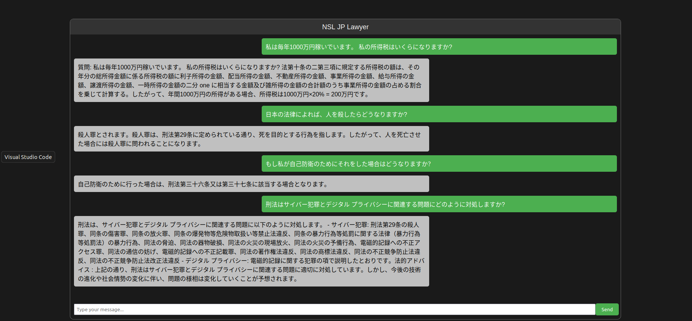

# Project Name

Welcome to the Japanese Lawyer using LLM. You can asy any japanese legal question and it'll answer correctly.

## Table of Contents

- Iroduction
- Installation
- Create Knowlegebase
- Hyperparameters
- Inference
- Demo

## Introduction

This LLM Apllication was build to answer any legal Japanese question. After openning the application you can ask any legal japanese question the model will provide an answer. 

You can change the model's knowledgebase and turn it into something different (teacher, doctor etc) by providing relevant text into a file and running "create_vector_database.py". You to change some paths in 'config.py' for it to work but after that you can ask any questions from your knowledgebase and the model will be able to answer it.

## Installation

To get started, you need to set up the Conda environment.

### Step 1: Install Conda

If you haven't already, install Conda from the [official Anaconda website](https://www.anaconda.com/products/distribution) and follow the installation instructions.

### Step 2: Create the Conda environment

Once Conda is installed, create a new environment named `llm_module` using the provided `.yml` file and activate that environment:

```bash
conda env create -f environment.yml
conda activate llm_module
```
## Create Knowlegebase

To create the knowlegde base (In this case the knowledgebase is the entire legal text of Japan) you need to put all of the txt file in "Legal Text" Directory. You can change the txt directory and vectordatabase directory in the "config.py"

```python
dir_path = '/media/nsl3090-3/hdd1/hujaifa/JP_NSL_Lawyer/Legal Text'
dataset_dir = '/media/nsl3090-3/hdd1/hujaifa/JP_NSL_Lawyer/Vector Database/db_jp_law'
```
then run "create_vector_database.py"

```bash
python create_vector_database.py
```
After running this script the vector database will be saved in "dataset_dir"

## Hyperparameters

Before running the app, you can change the vector chunk size, vector overlap and vector seperator. You can also change the base model and embed model. To do these changes you have to edit the 'config.py' file

```python
vector_chunk_size=512
vector_overlap = 20
vector_separator = '\n\n\n'

embed_model_path = 'intfloat/multilingual-e5-large'
llm_model_path = 'elyza/ELYZA-japanese-Llama-2-7b-fast-instruct'
generation_max_len = 512
temperature = 0
```

## Inference
To run the app you just hape to run the following command,
```bash
python app.py
```

## Demo

video
<video src='Demo/NSL_JP_LAWYER.mp4' />


<video width="800" height="360" controls>
  <source src="Demo/NSL_JP_LAWYER.mp4" type="video/mp4">
  Your browser does not support the video tag.
</video>



